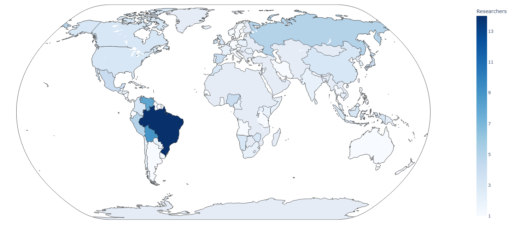

# 🌍 Global Student Perspectives on Learning with Generative Artificial Intelligence in Higher Education

  

This project presents interactive visualizations of the global collaboration network of researchers and universities participating in the study.
---

# 📌 Project Overview

This repository contains **interactive visualizations** of the global network of researchers and universities participating in the international research project:

**"Global Student Perspectives on Learning with Generative Artificial Intelligence in Higher Education: A Cross-Cultural Study."**

The maps illustrate the **🌎 geographical distribution of researchers and participating institutions worldwide**, supporting the analysis and dissemination of this international academic collaboration.

These visualizations were generated using **🐍 Python**, **📊 Pandas**, and **📈 Plotly**, and exported as **interactive HTML maps** that can be explored directly in a web browser.

---

# 🏛 Coordinating Institution

**Universidade Estadual de Campinas (UNICAMP)** – Brazil 🇧🇷

---

# 👩‍🔬👨‍🔬 Project Leadership

### ⭐ Principal Investigator  
**Danilo Rodrigues Pereira**

### 🤝 Co-Principal Investigator  
**Simone Appenzeller**

---

# 🗺 Interactive Maps Available

This repository includes **four interactive world maps** representing the **global collaboration network**.

---

# 👩‍💻 1. Researcher Distribution Maps

These maps show the **number of researchers involved in the project by country**, including the list of participating researchers associated with each country.

### 📂 Files

- 🌐 **[View Interactive Researcher Map - Layout 1](global_research_map_layout1.html)**
- 🌐 **[View Interactive Researcher Map - Layout 2](global_research_map_layout2.html)**

### ✨ Features

- 👩‍🔬 Number of researchers per country  
- 🧾 Interactive tooltips with researcher names  
- 🌍 Global visualization of collaboration distribution  

---

# 🏫 2. University / Institute Distribution Maps

These maps show the **number of universities or research institutions participating in the project by country**.

### 📂 Files

- 🌐 **[View Interactive University Map - Layout 1](global_universities_map_layout1.html)**
- 🌐 **[View Interactive University Map - Layout 2](global_universities_map_layout2.html)**

### ✨ Features

- 🏛 Number of participating institutions per country  
- 🧾 Interactive tooltips displaying institutions in each country  
- 🌍 Visualization of the institutional collaboration network  

---

# 💻 How to View the Maps

The maps are exported as standalone **HTML files** and can be viewed easily:

1️⃣ Download any `.html` file from this repository.  
2️⃣ Open the file in your preferred **web browser**.

✅ No additional software or dependencies are required.

---

# ⚙️ Technologies Used

- 🐍 **Python**
- 📊 **Pandas**
- 📈 **Plotly**
- 🔢 **NumPy**
- 🌐 **HTML Interactive Visualization**

---

# 🗂 Data Structure

The visualizations are generated from structured datasets containing information about:

- 👩‍🔬 Researchers participating in the study  
- 🏫 Affiliated universities or institutes  
- 🌍 Country of each institution  

The data are processed to produce **aggregated country-level visualizations**.

---

# 🎯 Purpose of the Visualizations

These maps aim to:

- 🌍 Illustrate the **global academic collaboration network**  
- 🤝 Highlight the **international diversity of participating researchers and institutions**  
- 📢 Support the **presentation and dissemination of the research project**

---

# 📄 License

This repository is intended for **academic and research dissemination purposes** related to the project.

📬 For additional information about the project, please contact the **project coordination team at UNICAMP**.
